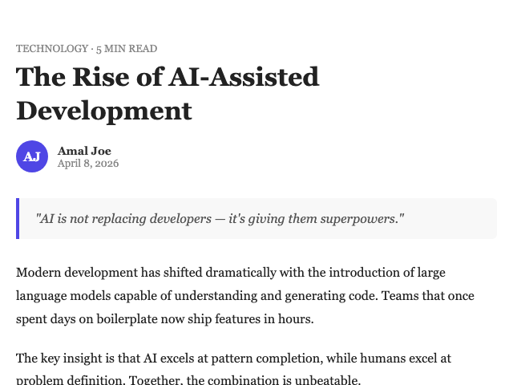
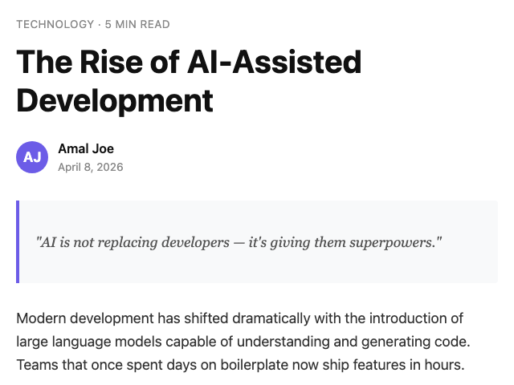
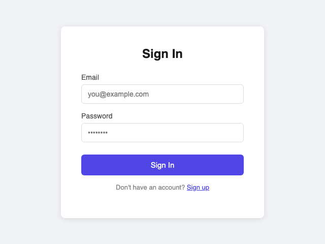
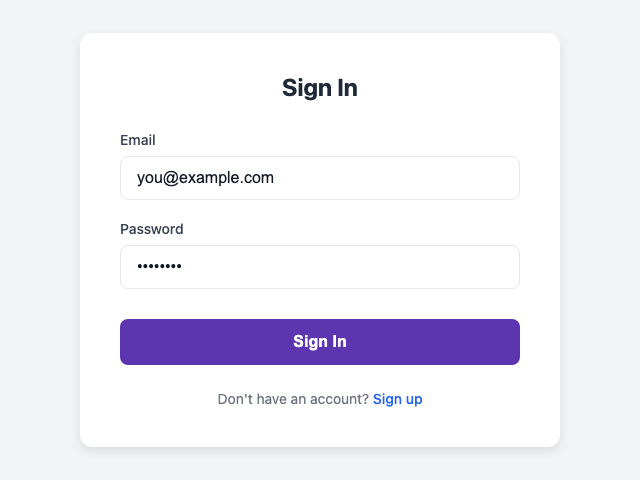
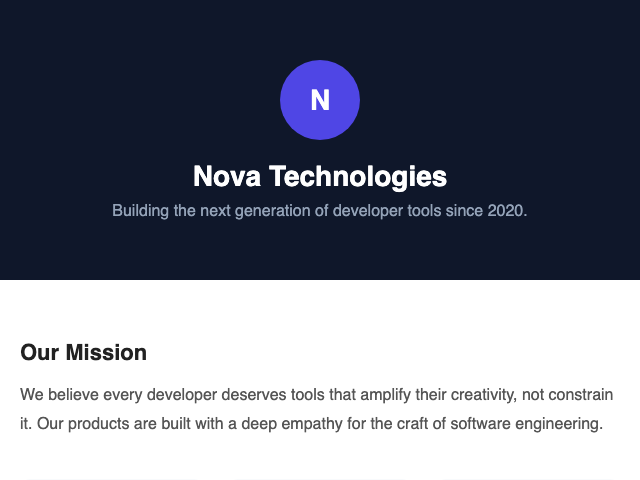
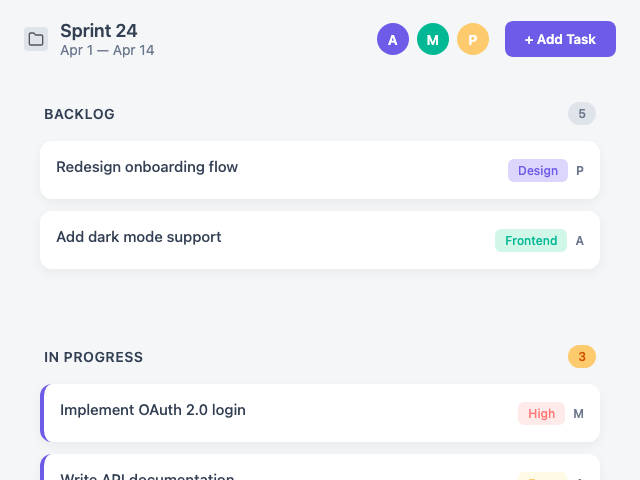

# VisionCoder OpenEnv

An [OpenEnv](https://github.com/openenv)-compatible reinforcement learning environment for screenshot-to-HTML generation. An agent receives a UI screenshot and is rewarded based on how accurately its generated HTML reproduces the original layout.

## Overview

Each episode:
1. `reset()` — returns a target UI screenshot (base64 PNG) and a task prompt
2. `step(action)` — submits HTML code, receives a composite reward score

### Reward signals

7 signals across 4 phases, normalised to [0, 1] by dividing by the weight sum (9.0):

| Signal | Weight | Phase | Description |
|---|---|---|---|
| `format` | 1× | 0 | Markdown fencing, `<html>` / doctype tags present |
| `validity` | 1× | 0 | HTML parseability, structural tags, tag diversity (≥5 unique) |
| `structural` | 1× | 0 | DOM tag-sequence similarity + CSS-class Jaccard overlap |
| `text_block` | 2× | 1 | Text block match rate + text content similarity (Hungarian matching on IoU) |
| `position` | 1× | 2 | Spatial layout accuracy — normalised centre-to-centre distance of matched blocks |
| `color` | 1× | 3 | Perceptual color accuracy via CIEDE2000 on sampled non-white pixels |
| `clip` | 2× | 4 | CLIP cosine similarity after Playwright render (`openai/clip-vit-base-patch32`, CPU) |

## Baseline results

Evaluated locally with `qwen3.5:4b` via Ollama across 5 episodes per difficulty (15 total). Best episode per difficulty selected requiring easy > medium > hard ordering. Reward pipeline weight sum = 9.0. Renders shown in the [Visual comparison](#visual-comparison) section below.

### Per-signal breakdown — `qwen3.5:4b`

| Difficulty | total | format | validity | structural | text_block | position | color | clip |
|---|---|---|---|---|---|---|---|---|
| easy   | 0.797 | 1.000 | 1.000 | 0.640 | 0.750 | 0.970 | 0.400 | 0.830 |
| medium | 0.471 | 1.000 | 1.000 | 0.490 | 0.150 | 0.520 | 0.000 | 0.460 |
| hard   | 0.432 | 1.000 | 1.000 | 0.430 | 0.115 | 0.267 | 0.000 | 0.480 |

**Mean reward across 3 difficulties: 0.567**

**Key observations:**
- `format` = 1.0 across all difficulties — qwen3.5 wraps output in markdown fences, which are stripped before scoring (rewarded for the fences present, not penalised)
- `validity` = 1.0 across all difficulties — generated HTML is always structurally well-formed
- Easy task (blog article): near-perfect `position` (0.97) and strong `text_block` (0.75) — model faithfully reproduces text-dominant layouts
- Medium task (sign-in form): `color` = 0.0 despite visually similar layout — button hue and background differ enough to collapse perceptual color score
- Hard task (company hero page): model hallucinates an entirely different UI (kanban board) — `clip` (0.48) and `text_block` (0.115) collapse together

---

## Visual comparison

### Easy — Blog article

| Reference | qwen3.5:4b |
|---|---|
|  |  |

| Signal | Weight | Score |
|---|---|---|
| format | 1× | 1.000 |
| validity | 1× | 1.000 |
| structural | 1× | 0.640 |
| text_block | 2× | 0.750 |
| position | 1× | 0.970 |
| color | 1× | 0.400 |
| clip | 2× | 0.830 |
| **total** | **9** | **0.797** |

**Analysis:** The reference is a text-heavy blog article with a title, author avatar, blockquote, and body paragraphs. qwen faithfully reproduces the layout — `position` (0.97) and `text_block` (0.75) confirm near-perfect spatial and textual accuracy. `color` (0.40) is lower because the author avatar shade and blockquote border color differ slightly from the reference.

---

### Medium — Sign-in form

| Reference | qwen3.5:4b |
|---|---|
|  |  |

| Signal | Weight | Score |
|---|---|---|
| format | 1× | 1.000 |
| validity | 1× | 1.000 |
| structural | 1× | 0.490 |
| text_block | 2× | 0.150 |
| position | 1× | 0.520 |
| color | 1× | 0.000 |
| clip | 2× | 0.460 |
| **total** | **9** | **0.471** |

**Analysis:** qwen reproduces the sign-in card with email/password fields and a purple CTA button — the structure is correct. `color` collapses to 0.0 because qwen uses a more saturated purple button while the reference has a softer indigo, and the background grey tones differ enough to fail the perceptual color threshold. `text_block` (0.15) is penalised because field labels and button text shift slightly in size and position.

---

### Hard — Company hero page

| Reference | qwen3.5:4b |
|---|---|
|  |  |

| Signal | Weight | Score |
|---|---|---|
| format | 1× | 1.000 |
| validity | 1× | 1.000 |
| structural | 1× | 0.430 |
| text_block | 2× | 0.115 |
| position | 1× | 0.267 |
| color | 1× | 0.000 |
| clip | 2× | 0.480 |
| **total** | **9** | **0.432** |

**Analysis:** The reference is a dark-themed branded hero — navy background, large "N" avatar circle, company name and tagline, with a light "Our Mission" section below. qwen hallucinates an entirely different UI: a light-themed kanban board (Sprint 24) with task cards, category badges, and avatar initials. This complete domain divergence collapses `text_block` (0.115), `position` (0.267), and `color` (0.0). `clip` (0.48) still partially fires because both pages share rounded cards and avatar elements, but the visual mismatch is stark.

---

## Installation

```bash
pip install -e .
```

## Running inference

```bash
export API_BASE_URL=https://router.huggingface.co/v1
export MODEL_NAME=Qwen/Qwen2.5-VL-72B-Instruct
export HF_TOKEN=hf_...
python inference.py
```

Required environment variables:

| Variable | Description |
|---|---|
| `HF_TOKEN` | Hugging Face token (used as API key) |
| `API_BASE_URL` | OpenAI-compatible LLM endpoint |
| `MODEL_NAME` | Vision-capable model ID |

Inference stdout format:

```
[START] task=<difficulty> env=vision-coder model=<model>
[STEP]  step=<n> action=<html_preview> reward=<0.00> done=<true|false> error=<msg|null>
[END]   success=<true|false> steps=<n> score=<0.000> rewards=<r1,...>
```

## Running the server

```bash
uvicorn openenv.server.app:app --host 0.0.0.0 --port 7860
```

## Docker / HF Spaces deployment

```bash
docker build -t vision-coder-openenv .
docker run -p 7860:7860 vision-coder-openenv
```

The image pre-downloads `openai/clip-vit-base-patch32` weights (~600 MB) and installs Playwright Chromium so the container starts instantly.

HF Space: [amaljoe88/vision-coder-openenv](https://huggingface.co/spaces/amaljoe88/vision-coder-openenv)

## Client usage

```python
from openenv.client import VisionCoderClient
from openenv.models import Action

with VisionCoderClient("http://localhost:7860") as client:
    obs = client.reset()

    # Decode the target screenshot
    image = client.decode_screenshot(obs)

    # Run your model inference here ...
    html = "<html><body><h1>Hello</h1></body></html>"

    result = client.step(Action(html=html))
    print(f"Reward: {result.reward}")
    print(f"Breakdown: {result.metadata['rewards']}")
```

## API reference

| Method | Endpoint | Description |
|---|---|---|
| `reset()` | `POST /reset` | Start a new episode |
| `step(action)` | `POST /step` | Submit HTML and receive reward |
| `state()` | `GET /state` | Current episode metadata |
| `close()` | `DELETE /close` | End the session |

## Project structure

```
├── inference.py           # Baseline inference script (runs 3 episodes)
├── openenv.yaml           # OpenEnv spec
├── Dockerfile
├── openenv/               # OpenEnv SDK package
│   ├── client.py          # Synchronous HTTP client
│   ├── models.py          # Action, Observation, State (Pydantic)
│   └── server/
│       ├── app.py         # FastAPI application
│       └── environment.py # VisionCoderEnvironment + reward pipeline
├── vcoder/                # Reward modules
│   └── rewards/
│       ├── format_rewards.py
│       ├── validity_rewards.py
│       ├── structural_rewards.py
│       ├── text_block_rewards.py
│       ├── position_rewards.py
│       ├── color_rewards.py
│       └── visual_rewards.py  # CLIP (openai/clip-vit-base-patch32)
└── data/                  # Bundled synthetic samples (5 per difficulty)
    ├── easy.json
    ├── medium.json
    └── hard.json
```
