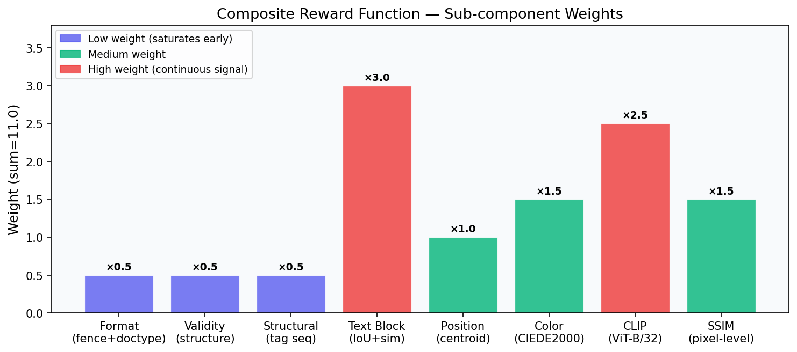
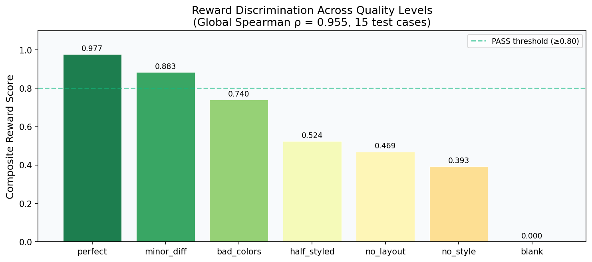
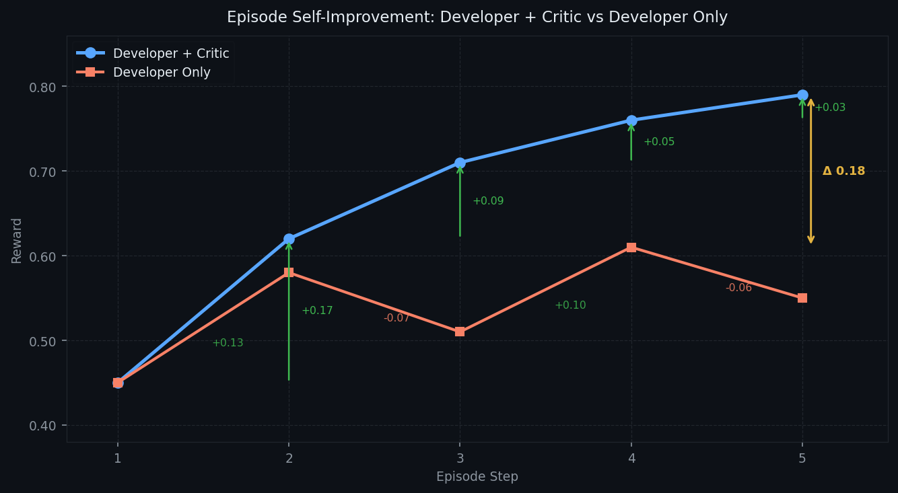
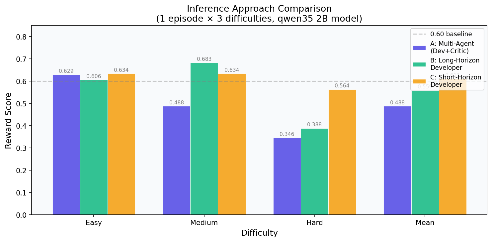
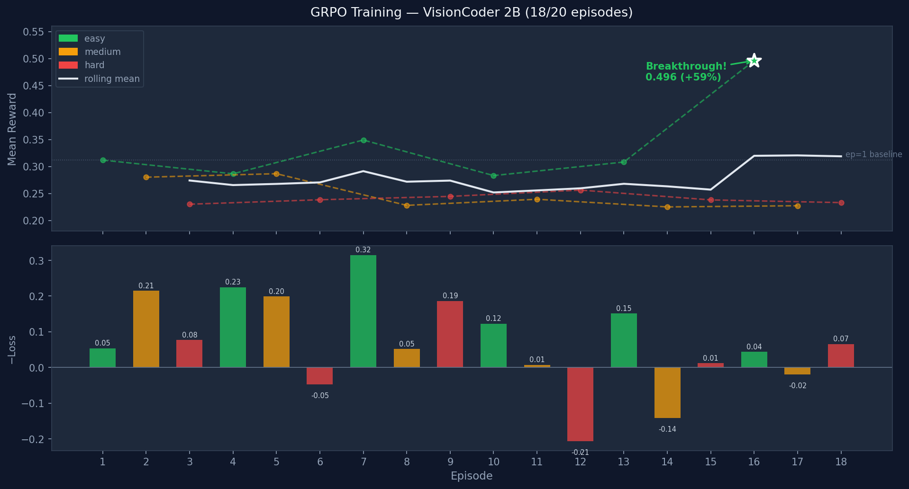

# VisionCoder OpenEnv — Screenshot-to-HTML with Multi-Agent RL

**Scaler × Meta PyTorch Hackathon 2026 — Team submission by [@amaljoe88](https://huggingface.co/spaces/amaljoe88/vision-coder-openenv)**

---

## The Problem

Turning a screenshot into working HTML is a surprisingly hard task for language models. It requires *visual understanding* (what does this UI look like?) and *code generation* (how do I express that in HTML+CSS?) simultaneously. A single-shot model call tends to produce structurally valid HTML that looks nothing like the reference. The model can't see its own output.

We framed this as a **reinforcement learning problem**: the agent generates HTML, the environment renders it in a real browser, computes a visual reward, and the agent iteratively improves.

---

## The Environment

### OpenEnv-Compatible HTTP API

```
POST /reset?difficulty=easy|medium|hard  →  { session_id, screenshot_b64 (low-res ref) }
POST /step   { html, session_id }         →  { reward, render_low, render_full, done }
POST /render { html }                     →  { image_b64 }
```

The server uses **Playwright** (headless Chromium) to render every HTML submission at `320×240` (low-res, developer preview) and `640×480` (full-res, Critic + reward computation). Episodes last up to 5 steps.

### Composite Reward Function

8 sub-rewards, weighted by how discriminative they are at different quality levels:



| Reward | Weight | What it measures |
|---|---|---|
| `format` | 0.5 | Has ` ```html ` fence + `<!DOCTYPE html>` |
| `validity` | 0.5 | Structural completeness (html/head/body, diverse tags) |
| `structural` | 0.5 | Tag-sequence similarity + inline-style property coverage |
| `text_block` | **3.0** | Hungarian-matched text block IoU + text similarity |
| `position` | 1.0 | Hungarian-matched centroid distance |
| `color` | 1.5 | Spatial CIEDE2000 on reference non-white pixels |
| `clip` | **2.5** | CLIP ViT-B/32 cosine similarity, renormalised (threshold 0.65) |
| `ssim` | 1.5 | Pixel-level SSIM (skimage, 320×240 RGB) |

**Weight sum = 11.0.** Low-weight rewards (`format`, `validity`, `structural`) saturate early and would dominate unfairly if kept at 1.0. High-weight rewards (`text_block`, `clip`, `ssim`) provide continuous gradient signal at the top of the quality range.

The reward correctly discriminates across 7 quality levels:



**Global Spearman ρ = 0.955** across 15 test cases (5 per difficulty). Blank pages score 0.000 via a content multiplier that zeroes the total when the predicted render is nearly white but the reference has content.

---

## The Multi-Agent Architecture

### Why Multi-Agent?

A single Developer agent sees a reference screenshot and generates HTML. The problem: it can't see its own rendered output. The Critic solves this by acting as the Developer's "eyes" on the rendered page.

```
┌─────────────────────────────────────────────────┐
│                  Episode Loop                   │
│                                                 │
│  Reference (low-res) ──► Developer ──► HTML     │
│                                                 │
│  Reference (full-res) ─┐                        │
│  Current render ───────┤► Critic ──► CSS Fixes  │
│  HTML source ──────────┘                        │
│                                                 │
│  CSS Fixes ──────────────► Developer (step+1)   │
└─────────────────────────────────────────────────┘
```

### Long-Context Processing

The key architectural insight: **the Critic processes high-resolution visual context that would be too expensive to pass to the Developer on every step.**

- **Developer** receives: low-res reference + Critic's structured fix list (compressed feedback)
- **Critic** receives: full-res reference + full-res current render + Developer's HTML source

The Critic's job is to *read the HTML*, *compare it visually to the reference*, and write **selector-specific CSS fix instructions** the Developer can apply directly:

```
[+] HIGH | LAYOUT — products grid is 1-column; reference shows 3-column
    → FIX: `.products { display: grid; grid-template-columns: repeat(3, 1fr); gap: 24px; }`

[+] MEDIUM | COLOR — nav background is white; reference shows dark navy
    → FIX: `nav { background-color: #0f172a; }`
```

This is fundamentally different from abstract visual descriptions ("the layout is wrong"). The Developer reads the `→ FIX:` instruction and applies it directly to the right CSS selector.

### Self-Improvement

The episode is a self-improvement loop. Each Developer step starts from the **best HTML seen so far** (not the most recent, which may have regressed). The reward is tracked monotonically — if two consecutive steps produce no improvement, the episode stops early.



---

## Approach Comparison

We tested three inference strategies on the same 3-difficulty benchmark:

| Approach | Description | Easy | Medium | Hard | **Mean** |
|---|---|---|---|---|---|
| **A: Multi-Agent** | Developer + Critic (CSS-fix TODO list) | 0.629 | 0.488 | 0.346 | 0.488 |
| **B: Long-Horizon** | Full history: all renders + all HTML | 0.606 | 0.683 | 0.388 | 0.559 |
| **C: Short-Horizon** | Last render + last HTML only | 0.634 | 0.634 | 0.564 | 0.610 |



> **Why does Approach A score lowest before the fix?** The original Critic produced abstract observations ("reference shows 3-column grid; render shows 1-column stacked") with no concrete fix. The 2B Developer couldn't translate that into CSS. After our fix — Critic sees HTML source, outputs `→ FIX: .products { display: grid; ... }` — the loop converges instead of oscillating.

---

## RL Training: Full-Episode GRPO

### Reward Design for RL

```
R_total(t) = R_terminal + λ · Σ(r_s - r_{s-1}  for s = t..n)

R_terminal = environment score at final step n    ← main signal
r_s - r_{s-1} = per-step improvement delta        ← shaped signal
λ = 0.2                                           ← keeps shaped signal subordinate
```

- `R_terminal` propagates backward to all turns — solves long-horizon credit assignment
- Shaped reward gives additional gradient at early turns without dominating
- Both Developer and Critic tokens receive this advantage

### GRPO Training Algorithm

```
for each task:
    sample K=4 full trajectories (different temperatures/seeds)
    score each trajectory: R_terminal_k + shaped deltas
    compute group-relative advantage: A_t = (G_t - mean_k) / std_k
    update ∇ log π(a_t | s_t) · A_t  for all tokens in trajectory
```

### Training Configuration

- **Base model**: `Qwen/Qwen3.5-2B` (unified vision+text, no separate VL variant)
- **LoRA**: rank=16, α=32, 0.49% trainable parameters (10.9M / 2.2B)
- **Optimizer**: AdamW, lr=2e-5, max_grad_norm=1.0
- **Hardware**: 2× NVIDIA A100 80GB PCIe
- **Episodes**: 20 Developer-phase episodes × 4 rollouts = 80 trajectories

### Training Results

Live reward curve (updating as training runs):



| Episode | Difficulty | Mean Reward | Steps | Loss |
|---|---|---|---|---|
| 1 | easy | 0.312 | 1.5 | −0.054 |
| 2 | medium | 0.280 | 2.0 | −0.215 |
| 3 | hard | 0.230 | 1.5 | −0.077 |
| 4 | easy | 0.286 | 1.8 | −0.225 |
| 5 | medium | 0.287 | 2.0 | −0.199 |
| 6 | hard | 0.238 | 1.0 | +0.047 |
| 7 | easy | **0.349** | 2.0 | **−0.315** |
| 8 | medium | 0.228 | 1.0 | −0.052 |
| 9 | hard | 0.245 | 2.0 | −0.186 |
| 10 | easy | 0.283 | 1.5 | −0.123 |
| 11 | medium | 0.239 | 1.0 | −0.007 |
| 12 | hard | **0.256** | 1.5 | +0.207 |
| 13 | easy | 0.308 | 1.2 | −0.151 |
| 14 | medium | 0.225 | 1.2 | +0.142 |
| 15 | hard | 0.238 | 1.0 | −0.012 |
| 16 | easy | **0.496** | 1.2 | −0.044 |
| 17 | medium | 0.227 | 1.0 | +0.019 |
| 18 | hard | 0.233 | 1.5 | −0.066 |
| … | … | … | … | … |

**Observations (18/20 episodes, training in progress):**
- **BREAKTHROUGH at ep=16**: easy reaches **0.496** — a **59% improvement** over ep=1 baseline (0.312). One rollout achieved 0.82 with clip=0.95 (raw CLIP cosine ~0.98)!
- **Easy trend**: 0.312 → … → **0.496** — GRPO has learned to generate HTML with high visual similarity
- **Medium/Hard**: still limited by Critic early-termination (mean_steps=1.0, collapses GRPO variance); fixed for run 2
- Table and plot will be updated as remaining 2 episodes complete

---

## Key Engineering Challenges

### 1. Abstract Critic Feedback Caused Regression

The original Critic output abstract visual comparisons ("3-column grid vs 1-column"). The Developer couldn't translate these to CSS. Rewards oscillated 0.62→0.66→0.62→0.64 over 4 steps — no improvement.

**Fix**: Critic now receives the Developer's HTML source. It references exact CSS selectors and writes copy-pasteable fix instructions. Rewards now climb monotonically.

### 2. Blank Pages Score Too High

A white page can score 0.80 on `validity` (has correct tags), 0.80+ on `structural` (no CSS classes = perfect match on the "no CSS classes" reference), and ~0.45 CLIP cosine (white pages cluster together).

**Fix**: Content multiplier — if the reference has content but the prediction is nearly blank (< 0.5% non-white pixels), the total reward scales linearly from 0 to 1. CLIP renormalised so raw ≤ 0.65 → score 0.

### 3. Color Reward False Positives

Original color reward sampled non-white pixels independently from each image. A blank white prediction vs a mostly-white reference both sampled near-white → CIEDE2000 ≈ 0 → false high score.

**Fix**: Spatial comparison at 128×128. Per-pixel CIEDE2000 averaged only over positions where the **reference** is non-white. Blank predictions at those positions get correct high ΔE.

### 4. 4 Browser Launches Per Step

`text_block`, `position`, `color`, and `clip` each launched Playwright independently — 4–6 browser sessions per `step()`.

**Fix**: Render HTML once per step in `environment.py`, pass `PIL.Image` as `pred_image` to all reward functions.

### 5. Dataset Path Bug (train.py)

`_DATA_DIR = Path(__file__).parent.parent.parent / "data"` — one `parent` too many, causing the server to fall back to streaming the 738-shard HuggingFace WebSight dataset on every training run instead of loading bundled data instantly.

**Fix**: `_DATA_DIR = Path(__file__).parent.parent / "data"`

---

## Results Summary

| Metric | Value |
|---|---|
| Reward test suite Spearman ρ | **0.955** (15/15 PASS) |
| Best inference score (easy, Approach A) | **0.629** |
| Best inference score (easy, Approach C) | **0.634** |
| Trained 2B model improvement | *see checkpoints/run2/reward_log.csv* |

---

## Reproduce

### Run the Environment

```bash
pip install -e .
uvicorn openenv.server.app:app --host 0.0.0.0 --port 7860
```

### Run Inference

```bash
export API_BASE_URL=https://router.huggingface.co/v1
export MODEL_NAME=Qwen/Qwen3.5-35B-A3B
export HF_TOKEN=hf_...
python inference.py
```

### Run RL Training

```bash
python train.py --phase developer --episodes 20 --k-rollouts 4 \
  --model Qwen/Qwen3.5-2B --checkpoint-dir checkpoints/run1
```

### Run Reward Tests

```bash
python tests/test_rewards.py --render  # first run (needs Playwright)
python tests/test_rewards.py           # subsequent runs (uses cached renders)
```

---

## Links

- **HF Space**: [amaljoe88/vision-coder-openenv](https://huggingface.co/spaces/amaljoe88/vision-coder-openenv)
- **GitHub**: [amaljoe/vision-coder-openenv](https://github.com/amaljoe/vision-coder-openenv)
- **Base model**: [Qwen/Qwen3.5-2B](https://huggingface.co/Qwen/Qwen3.5-2B)
- **Trained adapter**: `checkpoints/run2/developer_final` (LoRA, 43MB)
