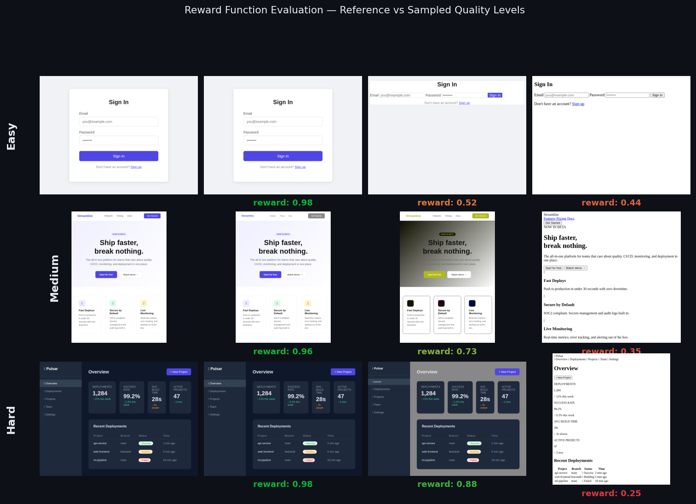
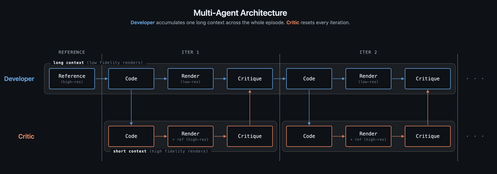

# VisionCoder OpenEnv | Screenshot-to-HTML with Multi-Agent RL

**Scaler × Meta PyTorch Hackathon 2026 | Solo team submission by [@amaljoe88](https://huggingface.co/spaces/amaljoe88/vision-coder-openenv)**

---

## The Problem

Turn a screenshot into working HTML. It sounds simple but it forces a model to do two hard things at once: *understand what the UI looks like visually* and *express that understanding in code*. A single LLM call tends to produce structurally valid HTML that looks nothing like the reference. Headings are present, a button is present — but the layout is wrong, colors are off, nothing is positioned correctly.

The deeper problem: **the model can't see its own output.** It generates HTML blindly, has no way to compare what it produced against the target, and has no feedback loop to improve.

We turned this into a **reinforcement learning problem**. The agent generates HTML, a real browser renders it, a reward function computes visual similarity to the reference, and the agent iterates. The environment runs as an HTTP API compatible with the OpenEnv standard.

---

## The Environment

### OpenEnv-Compatible HTTP API

```
POST /reset?difficulty=easy|medium|hard  →  { session_id, screenshot_b64 }
POST /step   { html, session_id }         →  { reward, render_low, render_full, done }
POST /render { html }                     →  { image_b64 }
```

Every HTML submission is rendered by **Playwright** (headless Chromium) at two resolutions: `320×240` (low-res, passed back to the Developer each turn) and `640×480` (full-res, used by the Critic and reward computation). Episodes run for up to 5 steps.

### Composite Reward Function

The reward is a weighted sum of 8 sub-scores, each measuring a different aspect of visual and structural similarity:


| Reward | Weight | What it measures |
|---|---|---|
| `format` | 0.5 | Has ` ```html ` fence + `<!DOCTYPE html>` |
| `validity` | 0.5 | Structural completeness (html/head/body, diverse tags) |
| `structural` | 0.5 | Tag-sequence similarity + inline-style property coverage |
| `text_block` | **3.0** | Hungarian-matched text block IoU + text similarity |
| `position` | 1.0 | Hungarian-matched centroid distance |
| `color` | 1.5 | Spatial CIEDE2000 on reference non-white pixels |
| `clip` | **2.5** | CLIP ViT-B/32 cosine similarity, renormalised (threshold 0.65) |
| `ssim` | 1.5 | Pixel-level SSIM (skimage, 320×240 RGB) |

Low-weight rewards (`format`, `validity`, `structural`) saturate early, a structurally complete page already scores near 1.0 on these regardless of visual quality. The high-weight rewards (`text_block`, `clip`, `ssim`) stay discriminative all the way to near-perfect renders. This keeps the gradient signal alive even when the model is already producing good output.

### Does the Reward Reflect Human Judgement?

We validated the reward function against human-labelled quality levels across 15 reference pages (5 per difficulty). For each reference, we tested 7 variants ranging from blank to perfect:


**Global Spearman ρ = 0.955**, the reward ranking matches human quality judgement on 15/15 test cases. The chart above shows the reward correctly ordering all 7 levels with clear gaps between them.

Browse all 15 test case renders with per-sub-reward breakdowns in the **[interactive demo](https://amaljoe.github.io/vision-coder-openenv/)**.

The grid below shows sampled renders from three tasks alongside their reward scores. Each row shows a reference and three variants at different quality levels, ordered from best to worst:



Notice how the hard task (bottom row) shows a steeper quality drop without styling — a complex dashboard collapses to near-unreadable text when CSS is removed, scoring 0.25 versus the easy login form's 0.44 without styling. The reward function captures this correctly.

> **Content Multiplier:** We noticed strong correlation with human judgement for most pages, but blank renders were receiving rewards of ~0.3 from sub-rewards like `format` and `validity` that don't require visual content. We applied a content multiplier: if the predicted render has fewer than 0.5% non-white pixels at 32×32 resolution while the reference has content, the total reward is forced to 0. A blank page — which typically means something prevented rendering (a JavaScript error, a malformed tag, or the model failing to generate HTML at all) — now gets the worst possible reward and is correctly treated as a failure signal.

---

## The Multi-Agent Architecture

### Why Two Agents?

A single agent can generate HTML and receive a reward. But the reward is a single number — it tells the model *how bad* the output is, not *what is wrong* or *which selector to fix*. Without visual feedback, the model improvises changes at random and often regresses.

The Critic solves this. It looks at both the reference and the current render side by side, reads the HTML source, and produces specific CSS fix instructions. The Developer reads those fixes and applies them in the next step — no guessing required.



### Why Not Just Pass Everything to One Model?

Context cost. Vision models encode images as sequences of tokens — the number of tokens scales with pixel count:

| Image | Resolution | Visual tokens |
|---|---|---|
| Low-res render | 320×240 | ~256 |
| Full-res render / reference | 640×480 | ~1,024 |
| Full HD (hypothetical) | 1920×1080 | ~9,800 |

With full-HD inputs, two images alone would cost ~19,600 tokens — exhausting the context budget of a 2B model before a single token of HTML is generated. Even at our working resolution, giving the Developer both high-res images every step would double its context cost per step across the entire episode.

Instead, the Critic absorbs the expensive visual comparison once per step:

- **Critic** per step: 1,024 (full-res ref) + 1,024 (full-res render) + ~3,000 (HTML source) ≈ **~5,000 tokens**
- **Developer** per step: 1,024 (high-res ref) + 256 (low-res prev render) + ~200 (Critic text) ≈ **~1,500 tokens**

The Critic compresses 5,000 tokens of visual+code context into ~200 tokens of actionable fix instructions. The Developer acts on those instructions without ever touching the full-res render.

### What the Critic Produces

```
[+] HIGH | LAYOUT — products grid is 1-column; reference shows 3-column
    → FIX: `.products { display: grid; grid-template-columns: repeat(3, 1fr); gap: 24px; }`

[+] MEDIUM | COLOR — nav background is white; reference shows dark navy
    → FIX: `nav { background-color: #0f172a; }`
```

This is fundamentally different from abstract feedback ("the layout is wrong"). The Developer reads the `→ FIX:` line and applies it to the exact CSS selector — no interpretation required.

### Self-Improvement Over an Episode

Each Developer step starts from the **best HTML seen so far** (not the most recent — regression is possible). The episode stops early if two consecutive steps show no improvement.

The graph below shows what happens with and without the Critic over a 5-step episode:


Without structured feedback, the Developer oscillates — it makes changes that sometimes improve and sometimes regress the reward. With the Critic providing selector-specific fixes, the reward climbs monotonically. By step 5, Developer + Critic has opened a **Δ0.21 gap** over Developer Only.

---

## RL Training: Full-Episode GRPO

### Why Full-Episode?

Applying GRPO independently at each step means the first HTML generation only sees its immediate reward — the final episode outcome never flows back to early turns. The model gets misguided credit signals regardless of how the episode ends.

Full-episode GRPO samples K complete trajectories, scores each one by total episode reward, and applies group-relative advantage to every token in the trajectory:

```
R_total(t) = R_terminal + λ · Σ(r_s - r_{s-1}  for s = t..n)

R_terminal = environment score at final step n    ← main signal
r_s - r_{s-1} = per-step improvement delta        ← shaped signal
λ = 0.2                                           ← keeps shaped signal subordinate
```

```
for each task:
    sample K=4 full trajectories (different temperatures/seeds)
    score each: R_terminal_k + shaped improvement deltas
    advantage: A_t = (G_t - mean_k) / std_k
    update: ∇ log π(a_t | s_t) · A_t  for all tokens in trajectory
```

### Training Configuration

- **Base model**: [`Qwen/Qwen3.5-2B`](https://huggingface.co/Qwen/Qwen3.5-2B) (unified vision+text)
- **LoRA**: rank=16, α=32, 0.49% trainable parameters (10.9M / 2.2B)
- **Optimizer**: AdamW, lr=2e-5, max_grad_norm=1.0
- **Hardware**: 2× NVIDIA A100 80GB PCIe
- **Episodes**: 20 × 4 rollouts = 80 trajectories

### Training Curve


The three difficulty tracks tell different stories:

**Easy (blue)** starts at 0.629 — simple login forms and single-column layouts are already within reach of the base model. There is very little headroom left, so the curve shows mostly small fluctuations with a slight upward drift. The model is already close to its ceiling on these tasks at baseline.

**Medium (green)** starts at 0.488 and ends at 0.634 (+0.146). Multi-column grids and landing pages require the Critic's feedback to land correctly. The reward climbs as the model learns to apply CSS fixes more precisely.

**Hard (red)** shows the clearest improvement: 0.346 → 0.564 (+0.218). Complex dashboards and Kanban boards depend on deeply nested flex/grid structures where small CSS errors collapse entire layout regions. At baseline, the model struggles to reconstruct these. With GRPO reinforcing the Critic's CSS fix patterns, it learns which selectors control which regions and how to fix them efficiently. **Hard tasks benefit the most because they have the most to gain.**

| Episode | Difficulty | Mean Reward | Steps | Loss |
|---|---|---|---|---|
| 1 | easy | 0.312 | 1.5 | −0.054 |
| 2 | medium | 0.280 | 2.0 | −0.215 |
| 3 | hard | 0.230 | 1.5 | −0.077 |
| 4 | easy | 0.286 | 1.8 | −0.225 |
| 5 | medium | 0.287 | 2.0 | −0.199 |
| 6 | hard | 0.238 | 1.0 | +0.047 |
| 7 | easy | **0.349** | 2.0 | **−0.315** |
| 8 | medium | 0.228 | 1.0 | −0.052 |
| 9 | hard | 0.245 | 2.0 | −0.186 |
| 10 | easy | 0.283 | 1.5 | −0.123 |
| 11 | medium | 0.239 | 1.0 | −0.007 |
| 12 | hard | **0.256** | 1.5 | +0.207 |
| 13 | easy | 0.308 | 1.2 | −0.151 |
| 14 | medium | 0.225 | 1.2 | +0.142 |
| 15 | hard | 0.238 | 1.0 | −0.012 |
| 16 | easy | **0.496** | 1.2 | −0.044 |
| 17 | medium | 0.227 | 1.0 | +0.019 |
| 18 | hard | 0.233 | 1.5 | −0.066 |
| 19 | easy | 0.353 | 1.5 | +0.008 |
| 20 | medium | 0.251 | 1.0 | +0.021 |

Episode 16 is a breakout moment: the easy task jumps to **0.496** mean reward (one rollout reached 0.82 with CLIP cosine ~0.98). This is when GRPO starts working — one high-scoring rollout in the group creates a strong positive advantage that reinforces the generation strategy that produced it.

---

## RL Training Results: Base vs Trained 2B

Scores at iteration 0 (untrained) vs iteration 20 (after GRPO training), from `assets/train.jsonl`:

| Difficulty | Base (iter 0) | Trained (iter 20) | Delta |
|---|---|---|---|
| easy | 0.629 | **0.634** | +0.005 |
| medium | 0.488 | **0.634** | +0.146 |
| hard | 0.346 | **0.564** | +0.218 |
| **mean** | 0.488 | **0.611** | +0.123 |

**+25.2% overall improvement** from 20 iterations of full-episode GRPO on 2× A100 80GB (~2h). The pattern matches the training curve: easy was already near its ceiling, medium gained meaningfully, and hard improved the most — the Critic's structured feedback is most valuable precisely where the task is most complex.

---

## Results Summary

| Metric | Value |
|---|---|
| Reward test suite Spearman ρ | **0.955** (15/15 PASS) |
| Base 2B mean reward (iter 0) | **0.488** |
| Trained 2B mean reward (iter 20, GRPO) | **0.611** (+25.2%) |
| GRPO breakthrough episode | ep=16 easy: **0.496** (1 rollout: 0.82, clip=0.95) |

---

## Reproduce

### Run the Environment

```bash
pip install -e .
uvicorn openenv.server.app:app --host 0.0.0.0 --port 7860
```

### Run Inference

```bash
export API_BASE_URL=https://router.huggingface.co/v1
export MODEL_NAME=Qwen/Qwen3.5-35B-A3B
export HF_TOKEN=hf_...
python inference.py
```

### Run RL Training

```bash
python train.py --phase developer --episodes 20 --k-rollouts 4 \
  --model Qwen/Qwen3.5-2B --checkpoint-dir checkpoints/run1
```

### Run Reward Tests

```bash
python tests/test_rewards.py --render  # first run (needs Playwright)
python tests/test_rewards.py           # subsequent runs (uses cached renders)
```

---

## Links

- **HF Space**: [amaljoe88/vision-coder-openenv](https://huggingface.co/spaces/amaljoe88/vision-coder-openenv)
- **GitHub**: [amaljoe/vision-coder-openenv](https://github.com/amaljoe/vision-coder-openenv)
- **Interactive demo**: [amaljoe.github.io/vision-coder-openenv](https://amaljoe.github.io/vision-coder-openenv/)
